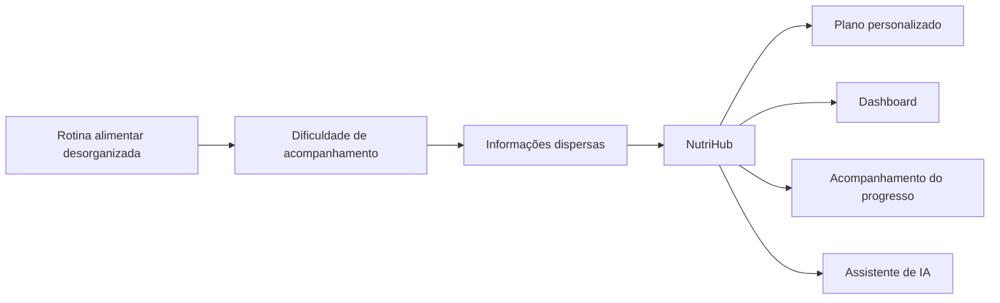
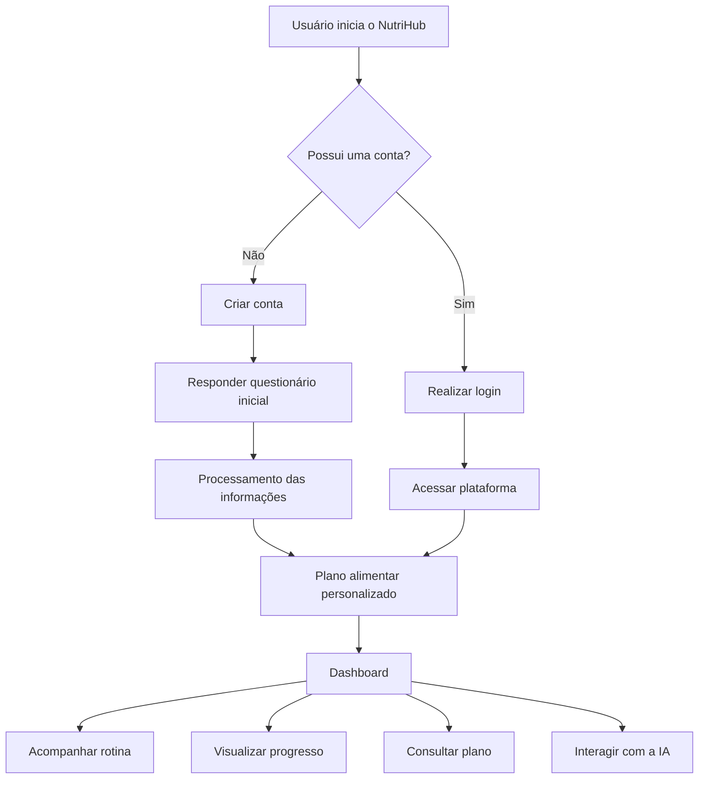
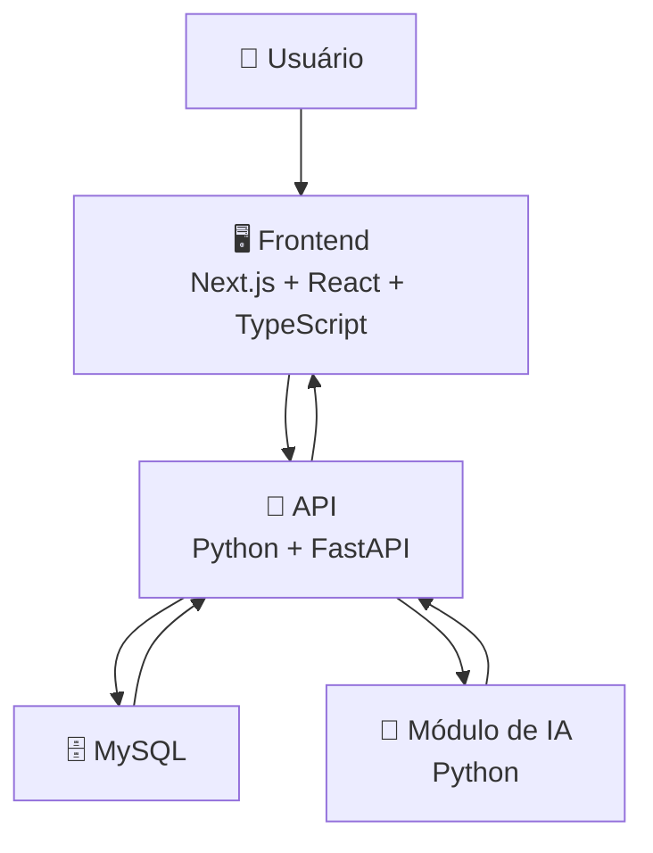
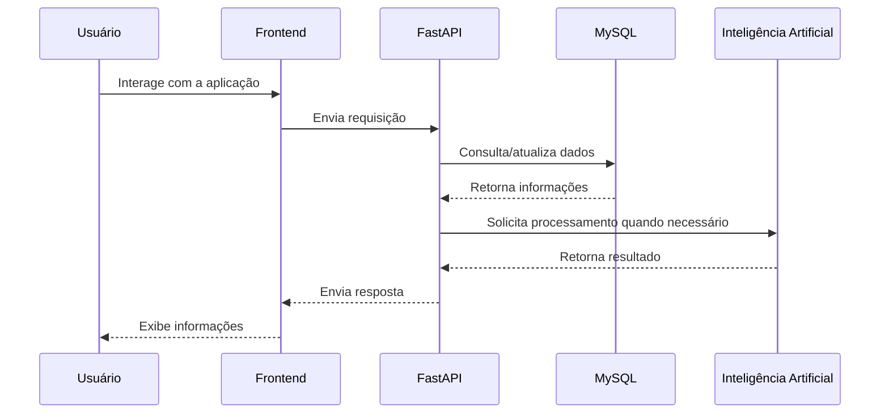
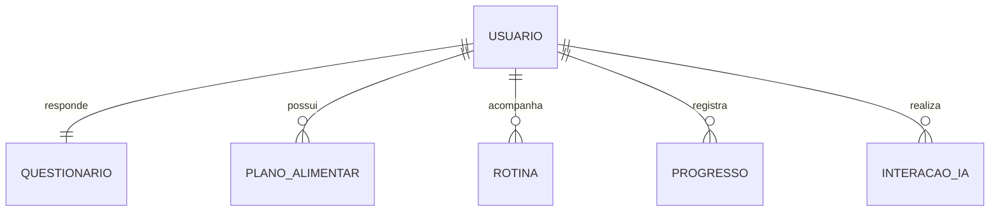
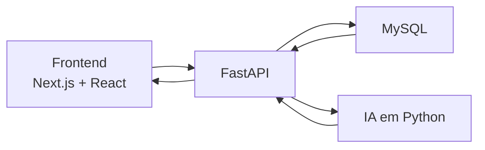
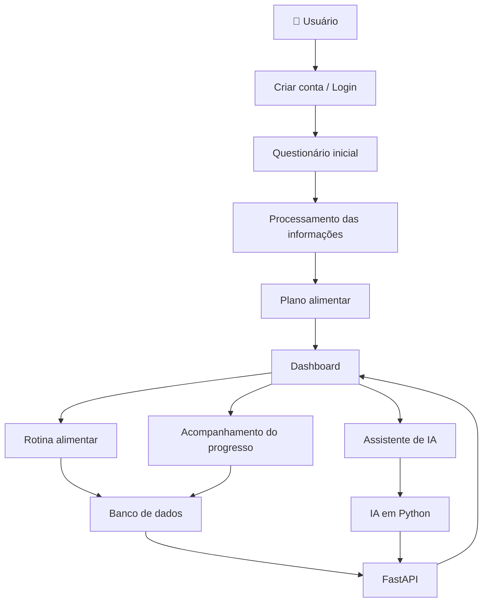
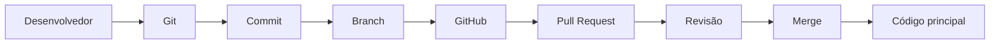

# 🥗 NutriHub

> **Plataforma para organização e acompanhamento de rotinas alimentares**

---

## 📌 1. Informações do Projeto

### 🏫 Instituição

| Informação                 | Dados                                         |
| -------------------------- | --------------------------------------------- |
| **Faculdade/Universidade** | `UNDB`                                        |
| **Curso**                  | `Engenharia de Software`                      |
| **Disciplina**             | `Programação Orientada a Objetos`             |
| **Professor(a)**           | `Rondineli Seba`                              |
| **Turma/Sala**             | `ESBN04`                                      |
| **Período/Semestre**       | `4° Período`                                  |

### 👥 Equipe

| Integrante             | Função no projeto | Responsabilidades                                                            |
| ---------------------- | ----------------- | ---------------------------------------------------------------------------- |
| `João Lucas Gomes`     | `Tech Lead`       | `Coordena as decisões técnicas e a organização do desenvolvimento`           |
| `João Lucas Gomes`     | `DevOps`          | `Gerencia versionamento, ambientes, integração e infraestrutura do projeto.` |
| `Lucas Saldanha`       | `Front End`       | `Desenvolve a interface e a experiência visual do usuário.`                  |
| `Asafe Siva`           | `Back End`        | `Desenvolve a lógica do sistema e a comunicação com o banco de dados.`       |
| `Jaylon Coelho`        | `QA`              | `Testa o sistema e identifica erros e problemas`                             |

### 📋 Identificação

| Informação          | Dados              |
| ------------------- | ------------------ |
| **Nome do projeto** | NutriHub           |
| **Versão**          | 1.0                |
| **Status**          | Em desenvolvimento |
| **Data de início**  | `25/09/2026`       |

---

# 💡 2. Ideia do Projeto

O **NutriHub** é uma aplicação destinada a auxiliar usuários na organização e no acompanhamento de suas rotinas alimentares.

A plataforma permitirá que o usuário crie uma conta, responda a um questionário inicial com informações relacionadas à sua rotina e objetivos alimentares e, a partir dessas informações, tenha acesso a um plano personalizado.

O sistema contará com um **dashboard**, no qual o usuário poderá visualizar sua rotina alimentar, acompanhar seu progresso e consultar informações relacionadas ao seu plano.

Além disso, o NutriHub contará com uma **inteligência artificial que atuará como assistente virtual**, auxiliando o usuário durante o acompanhamento de sua rotina alimentar.

> **Observação:** a inteligência artificial será apresentada de forma explícita como IA e não como um nutricionista humano. O sistema tem como objetivo auxiliar na organização e no acompanhamento da rotina alimentar.

---

# 👤 3. Cliente / Público-Alvo

O NutriHub é destinado principalmente a:

> **Pessoas que desejam organizar, acompanhar e melhorar sua rotina alimentar por meio de uma plataforma digital personalizada.**

O projeto será direcionado ao usuário final, não sendo prevista, nesta versão, uma interface específica para nutricionistas.

### Público-alvo

| Público                                                    | Necessidade                                   |
| ---------------------------------------------------------- | --------------------------------------------- |
| Pessoas que desejam organizar sua alimentação              | Centralizar informações e rotina              |
| Pessoas que desejam acompanhar seu progresso               | Visualizar evolução e histórico               |
| Pessoas que possuem dificuldade em manter uma rotina       | Receber organização e acompanhamento          |
| Usuários interessados em tecnologia aplicada à alimentação | Utilizar uma plataforma digital personalizada |

---

# ❗ 4. Problema que o Projeto Resolve

Muitas pessoas possuem dificuldade em manter uma rotina alimentar organizada e acompanhar seu progresso ao longo do tempo.

Informações relacionadas a refeições, metas, rotina e evolução podem ficar dispersas, dificultando o acompanhamento diário e a manutenção da organização.

O NutriHub busca solucionar esse problema ao centralizar essas informações em uma única plataforma.

### Problema → Solução



---

# ⚙️ 5. Funcionamento do Sistema

O funcionamento inicial do NutriHub será baseado no seguinte fluxo:



### Jornada do usuário

1. O usuário inicia o NutriHub.
2. Cria uma conta ou realiza login.
3. Caso seja um novo usuário, responde ao questionário inicial.
4. As informações são processadas pelo sistema.
5. O sistema disponibiliza um plano alimentar personalizado.
6. O usuário acessa seu dashboard.
7. O usuário acompanha sua rotina e progresso.
8. O usuário pode interagir com o assistente de inteligência artificial.

---

# 🏗️ 6. Arquitetura do Projeto

O NutriHub será desenvolvido utilizando uma arquitetura composta por **frontend, backend, banco de dados e módulo de inteligência artificial**.



### Componentes da arquitetura

| Componente              | Tecnologia                   | Responsabilidade                                     |
| ----------------------- | ---------------------------- | ---------------------------------------------------- |
| Frontend                | Next.js + React + TypeScript | Interface utilizada pelo usuário                     |
| Backend                 | Python + FastAPI             | Regras do sistema e comunicação entre os componentes |
| Banco de dados          | MySQL                        | Armazenamento dos dados                              |
| Inteligência Artificial | Python                       | Funcionamento do assistente virtual                  |
| Versionamento           | Git + GitHub                 | Controle de versões e colaboração                    |

### Comunicação entre os componentes



---

# 💻 7. Tecnologias e Linguagens

| Área           | Tecnologia | Utilização                                           |
| -------------- | ---------- | ---------------------------------------------------- |
| Estrutura      | HTML       | Estrutura da interface                               |
| Estilização    | CSS        | Aparência e estilização                              |
| Linguagem      | JavaScript | Lógica e interações do frontend                      |
| Linguagem      | TypeScript | Tipagem e organização do frontend                    |
| Biblioteca     | React      | Construção dos componentes da interface              |
| Framework      | Next.js    | Desenvolvimento da aplicação web                     |
| Backend        | Python     | Desenvolvimento da lógica do servidor                |
| API            | FastAPI    | Criação da API                                       |
| Banco de dados | MySQL      | Armazenamento dos dados                              |
| IA             | Python     | Desenvolvimento do módulo de inteligência artificial |
| Versionamento  | Git        | Controle de versões                                  |
| Colaboração    | GitHub     | Trabalho em equipe e gerenciamento do código         |

---

# 🗄️ 8. Banco de Dados

O **MySQL** será utilizado como sistema de gerenciamento do banco de dados do NutriHub.

Ele será responsável por armazenar e organizar as informações necessárias para o funcionamento da aplicação.

### Entidades previstas

| Entidade          | Responsabilidade                                        |
| ----------------- | ------------------------------------------------------- |
| Usuário           | Dados da conta e perfil                                 |
| Questionário      | Informações fornecidas pelo usuário no cadastro         |
| Plano Alimentar   | Dados relacionados ao plano do usuário                  |
| Rotina            | Atividades e informações da rotina alimentar            |
| Progresso         | Registro da evolução do usuário                         |
| Interações com IA | Informações relacionadas às interações com o assistente |

> **Observação:** essas entidades representam uma proposta inicial. A estrutura definitiva do banco de dados será definida durante o desenvolvimento do projeto.

### Relação simplificada



---

# 🔌 9. Integrações e APIs

A principal API do NutriHub será desenvolvida utilizando **FastAPI e Python**.

Ela funcionará como intermediária entre o frontend, banco de dados e módulo de inteligência artificial.



### Responsabilidades da API

| Comunicação        | Responsabilidade                             |
| ------------------ | -------------------------------------------- |
| Frontend → FastAPI | Enviar informações e solicitações do usuário |
| FastAPI → MySQL    | Consultar e armazenar dados                  |
| FastAPI → IA       | Enviar informações para processamento        |
| FastAPI → Frontend | Retornar informações para a interface        |

### Exemplos iniciais de endpoints

```text
POST /login
POST /usuarios
GET  /perfil
POST /questionario
GET  /rotina
GET  /progresso
POST /ia
```

> Os endpoints apresentados são exemplos iniciais e poderão ser alterados conforme a evolução da aplicação.

---

# 📁 10. Estrutura do Projeto

A estrutura inicial proposta para o projeto é:

```text
NutriHub/
│
├── frontend/                  # Interface da aplicação
│   ├── components/            # Componentes reutilizáveis
│   ├── pages/                 # Páginas da aplicação
│   ├── public/                # Arquivos públicos
│   └── ...
│
├── backend/                   # API e lógica do sistema
│   ├── routes/                # Endpoints da API
│   ├── models/                # Modelos de dados
│   ├── services/              # Regras e serviços da aplicação
│   ├── database/              # Conexão e configuração do MySQL
│   └── main.py                # Inicialização da API
│
├── ai/                        # Módulo de inteligência artificial
│   ├── models/                # Modelos utilizados pela IA
│   ├── services/              # Serviços e lógica da IA
│   └── main.py                # Inicialização do módulo de IA
│
├── tests/                     # Testes do sistema
│
├── docs/                      # Documentação técnica
│
├── .gitignore                 # Arquivos ignorados pelo Git
├── README.md                  # Documentação principal
└── requirements.txt           # Dependências Python
```

### Organização das principais pastas

| Pasta/arquivo      | Função                                       |
| ------------------ | -------------------------------------------- |
| `frontend/`        | Interface utilizada pelo usuário             |
| `backend/`         | API e lógica principal do sistema            |
| `routes/`          | Endpoints da API                             |
| `models/`          | Modelos de dados                             |
| `services/`        | Regras e serviços da aplicação               |
| `database/`        | Configuração do banco de dados               |
| `ai/`              | Código relacionado à inteligência artificial |
| `tests/`           | Testes da aplicação                          |
| `docs/`            | Documentação técnica                         |
| `.gitignore`       | Arquivos que não devem ser enviados ao Git   |
| `README.md`        | Documentação principal                       |
| `requirements.txt` | Dependências Python                          |

> **Observação:** a estrutura apresentada é inicial e poderá ser modificada conforme o projeto evoluir.

---

# 🎯 11. Objetivos do Projeto

## Objetivo Geral

Desenvolver o **NutriHub**, uma aplicação destinada a auxiliar usuários na organização e no acompanhamento de suas rotinas alimentares, oferecendo um ambiente centralizado para visualização do plano alimentar, acompanhamento do progresso e interação com uma inteligência artificial.

## Objetivos Específicos

* Permitir que o usuário crie e gerencie sua conta.
* Coletar informações do usuário por meio de um questionário inicial.
* Gerar uma rotina alimentar personalizada com base nas informações fornecidas.
* Disponibilizar um dashboard para acompanhamento da rotina e do progresso.
* Permitir o registro e acompanhamento das atividades relacionadas à alimentação.
* Disponibilizar uma inteligência artificial como assistente virtual.
* Armazenar e organizar os dados do usuário de forma estruturada.
* Integrar frontend, backend, banco de dados e inteligência artificial.
* Aplicar conceitos de desenvolvimento de software, APIs, banco de dados, versionamento e trabalho colaborativo.

---

# 🔄 Fluxo Geral do NutriHub



---

# 👥 Fluxo de Desenvolvimento da Equipe

O desenvolvimento será realizado de forma colaborativa utilizando **Git e GitHub**.



---

# 🚀 Status do Projeto

🟡 **Em desenvolvimento**

O projeto encontra-se em fase de planejamento e definição de arquitetura, tecnologias e funcionalidades.

As próximas etapas envolverão:

* [ ] Definição completa dos requisitos
* [ ] Definição da identidade visual
* [ ] Modelagem do banco de dados
* [ ] Criação do projeto frontend
* [ ] Criação da API
* [ ] Implementação do banco de dados
* [ ] Desenvolvimento do módulo de IA
* [ ] Integração entre frontend e backend
* [ ] Implementação do dashboard
* [ ] Testes
* [ ] Deploy da aplicação

---

# 📚 Observações

O NutriHub é um projeto acadêmico desenvolvido com o objetivo de aplicar conhecimentos de desenvolvimento de software, desenvolvimento web, APIs, bancos de dados, inteligência artificial, controle de versão e trabalho colaborativo.

A inteligência artificial presente no sistema possui caráter de **assistente virtual** e não representa um nutricionista humano ou substitui acompanhamento profissional especializado.

---

## 🛠️ Desenvolvido por

**Equipe NutriHub**

> `João Gomes` • `Tech Lead e DevOps`
> `Lucas Saldanha` • `Front End`
> `Asafe Silva` • `Back End`
> `Jaylon Coelho` • `QA`
